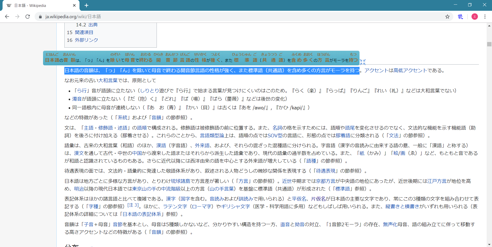
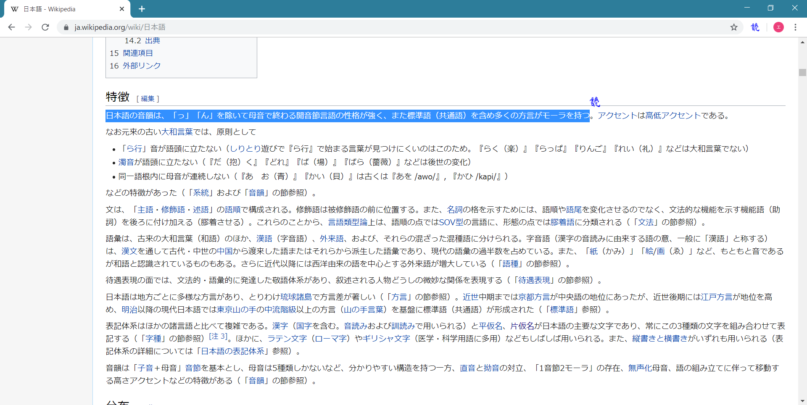
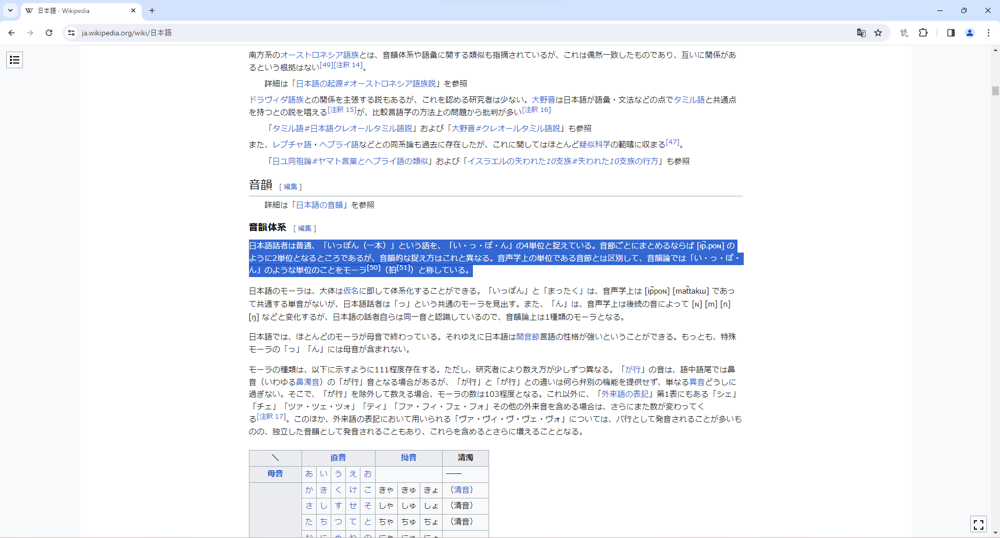

# 読みちゃん

## 読みちゃんとは

日本語の漢字にふりがなを付けるChrome拡張機能です。

## インストール

- chrome ウェブストアに公開していないため、 [デベロッパー モード] でインストールしてください。 
[「カスタムの Chrome アプリと拡張機能を作成して公開する」](https://support.google.com/chrome/a/answer/2714278?hl=ja)の手順2をご参照ください。  

## 使い方
- 漢字を含むテキストを選択すると、該当テキストの漢字にふりがなを付けるメッセージを表示できる。
 

- ふりがなを付けるメッセージの右下の縮小ボタンを押下すると、常に「読」アイコンだけ表示できる。該当アイコンを押下すると、ふりがなを付けるメッセージを表示する。
 

- ブラウザの「読」アイコンを押下すると、アイコンをグレーにし、ふりがなを付けるメッセージを表示しないように設定できる。
 
