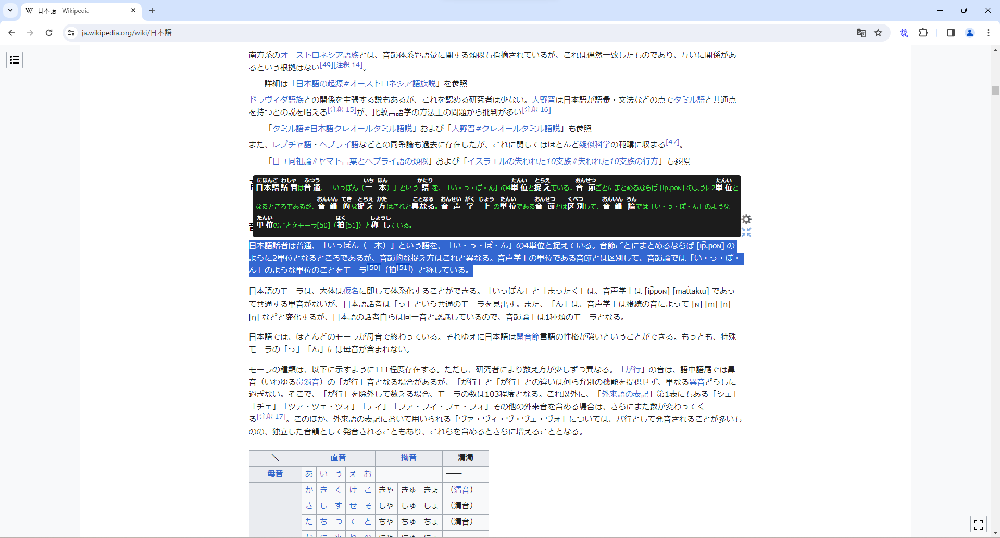

# 読みちゃん

## 読みちゃんとは

日本語の漢字にふりがなを付けるChrome拡張機能です。

## インストール

- [「chrome ウェブストア」](https://chrome.google.com/webstore/detail/yomichan/nbfhegiidojdmnahegkphdoabohfmoof?hl=ja&authuser=0)からインストールしてください。

## 使い方
- 漢字を含むテキストを選択すると、該当テキストの漢字にふりがなを付けるメッセージを表示できる。
 

- ふりがなを付けるメッセージの右下の縮小ボタンを押下すると、常に「読」アイコンだけ表示できる。該当アイコンを押下すると、ふりがなを付けるメッセージを表示する。
 

- 縮小ボタンの上の設定ボタンを押下すると、右に設定ポップアップを表示する。設定ポップアップでメッセージの背景色・文字の色とサイズを変更できる。
 

- ブラウザの「読」アイコンを押下すると、アイコンをグレーにし、ふりがなを付けるメッセージを表示しないように設定できる。
 
